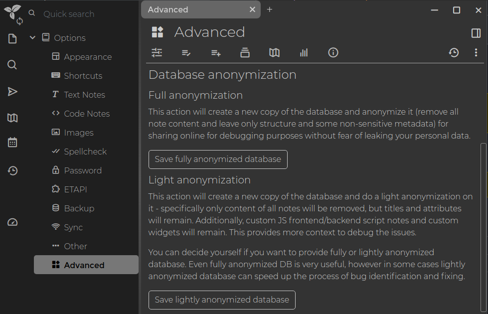

# Anonymized database
### Anonymized database

In some cases, it's necessary to see the database structure to be able to debug the problem. Of course, we can't ask you to send us [Document](Document.md) file with your notes.

For this, Trilium supports anonymization of the database - you can trigger this in Options -> Advanced tab.



This will create a copy of your document and remove all sensitive data (currently note titles, contents, revisions, history and some of the options, and non-system attributes) while leaving all structure and metadata (e.g. date of last change). After this is done, the database is [VACUUMed](https://sqlite.org/lang_vacuum.html) to make sure there's no stale sensitive data in the document file. The resulting file is stored in `anonymized` directory (placed in the [data directory](Data-directory.md)). You can safely attach it with your bug report or send it to [zadam.apps@gmail.com](#root/N3Zt66yETj9g) %%{WARNING}%%

#### Command line anonymization

If the database is corrupted in a way which prevents Trilium to start up, you won't be able to trigger the anonymization from the UI. For such a case, anonymization is also available from command line:

```text-plain
node src/anonymize.js
```

This needs to be executed in the directory with Trilium source files, for desktop builds this in `resources/app` directory.