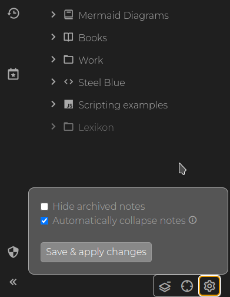

# Archived-notes
Archived notes are notes which have `archived` [attribute](Attributes.md) - either directly or [inherited](Attribute%20inheritance.md).

Such notes are then by default not shown in the autocomplete and in the full text [search](Search.md).

This can be useful for notes which are no longer very useful but still valuable enough to keep around without them getting too much in the way.

You can control whether archived notes are displayed in the note tree with a setting:

