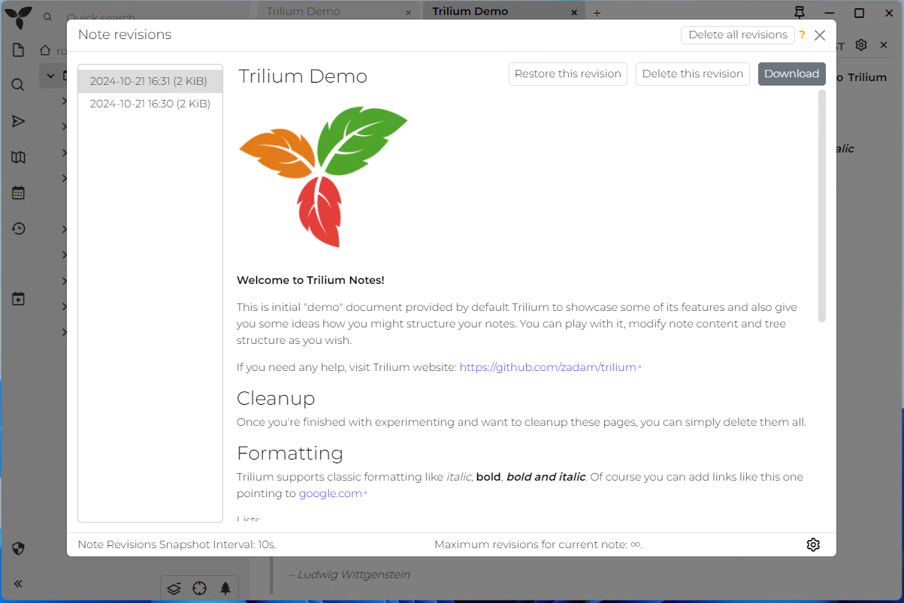

# Screenshot tour
Sometimes the fastest way to assess the software is just through screenshots so here they are:

See [Themes](Themes.md).

This shows [code note](Code-notes.md) editor.

See [promoted attributes](Promoted%20attributes.md)

See [relation map](Relation-map.md).

See [link map](Link-map.md).

See [Day notes](Day-notes.md).

See [Weight tracker](Weight-tracker.md).

See [Task manager](Task-manager.md).

See [Note revisions](Note%20revisions.md).

See [Mobile frontend](Mobile-frontend.md).