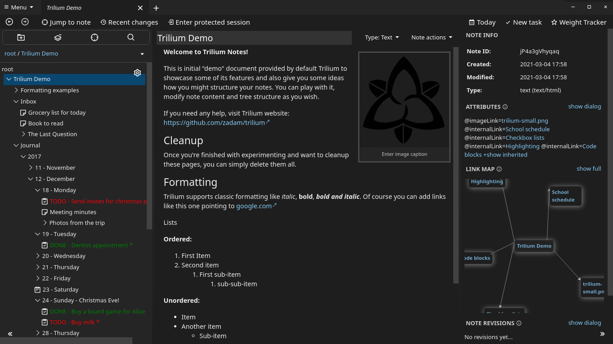

# Theme-Gallery
Theme Gallery
-------------

These are user-created themes which were made publicly available:

|     |     |
| --- | --- |
| [Midnight](https://github.com/tobealive/trilium-midnight-theme)   👤 [tobealive](https://github.com/tobealive)  | [EOTE](https://github.com/tobealive/trilum-eote-theme)   👤 [tobealive](https://github.com/tobealive)  |
| [Trilium Themes](https://github.com/Abourass/TriliumThemes)   👤 [Abourass](https://github.com/Abourass)         | [MaterialDark](https://github.com/ZMonk91/Material-Dark-Trilium)   👤 [ZMonk91](https://github.com/ZMonk91)    |
| [lightslategray](https://github.com/jaroet/trilium-theme-lightslategray)   👤 [jaroet](https://github.com/jaroet)    | [melon-4](https://github.com/raphwriter/trilium-theme-melon)   👤 [raphwriter](https://github.com/raphwriter)    |
| [Neon\_Dark](https://github.com/Engr-AllanG/trilium-themes)   👤 [Engr-AllanG](https://github.com/Engr-AllanG)    | [Coder\_Dark](https://github.com/Engr-AllanG/trilium-themes)   👤 [Engr-AllanG](https://github.com/Engr-AllanG)    |
| [velvet](https://github.com/idelem/trilium-theme-velvet)   👤 [idelem](https://github.com/idelem)    | [Dark Plus](https://github.com/SADAVA/trilium-notes-theme-dark-plus)   👤 [SADAVA](https://github.com/SADAVA)    |
| [Solarized](https://github.com/WKSu/trilium-solarized-theme)   👤 [WKSu](https://github.com/WKSu)    | [Nord](https://github.com/en3r0/Trilium-Nord-Theme)   👤 [en3r0](https://github.com/en3r0)    |
| [Bear Note Light](https://github.com/AllanZyne/trilium-bear-theme)   👤 [AllanZyne](https://github.com/AllanZyne)    | [Bear Note Dark](https://github.com/AllanZyne/trilium-bear-theme)   👤 [AllanZyne](https://github.com/AllanZyne)    |
| [Miku Hatsune](https://github.com/Sebiann/miku-hatsune-trilium-theme)   👤 [Sebiann](https://github.com/Sebiann)    | [Midnight](https://github.com/cwilliams5/Midnight-Trilium-Dark-Mode)   👤 [cwilliams5](https://github.com/cwilliams5)    |
| [Blue](https://github.com/SiriusXT/trilium-theme-blue) (light)   👤 [SiriusXT](https://github.com/SiriusXT)    | [Blue](https://github.com/SiriusXT/trilium-theme-blue) (dark)   👤 [SiriusXT](https://github.com/SiriusXT)    |

If you would like to add your theme to this gallery, write a new post in [👐 Show and tell](https://github.com/TriliumNext/Notes/discussions/categories/show-and-tell).