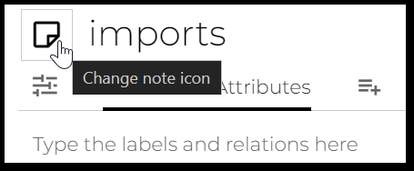
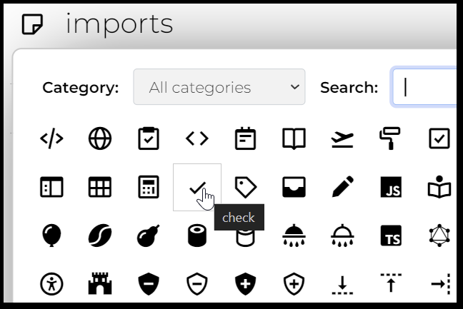

# Note Icons

Icons are useful for distinguishing notes. At the technical level, they are set by the **`iconClass`** attribute which adds a CSS class to the note. For example `#iconClass="bx bx-calendar"` will show a calendar instead of the default page or folder icon. Looking up and remembering the css class names is not necessary. While editing a note, click on the icon next to the title to bring up a chooser gallery:

