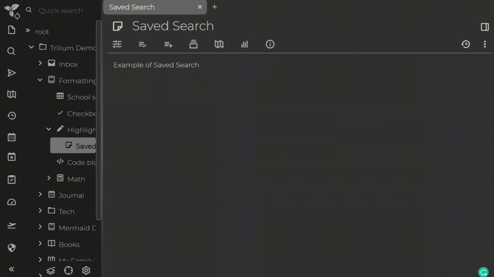

# Saved Searches

Trilium allows you to save common searches as notes within the note tree. The search results will appear as sub-notes under these "saved search" notes. Here is an example of how it works:

## Location

By default, saved searches are stored in the day note. However, you can designate a different note to store saved searches by marking it with the `#searchHome` label. Additionally, for [workspaces](workspace.md), you can use the `#workspaceSearchHome` label to specify a storage location for saved searches within that workspace.
