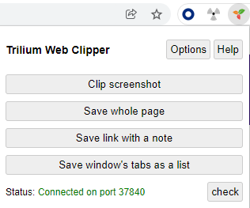

# Web-clipper

Trilium Web Clipper is a web browser extension which allows user to clip text, screenshots, whole pages and short notes and save them directly to Trilium Notes.

Project is hosted [here](https://github.com/TriliumNext/web-clipper).

Firefox and Chrome are supported browsers, but the chrome build should work on other chromium based browsers as well.

## Functionality

* select text and clip it with the right-click context menu
* click on an image or link and save it through context menu
* save whole page from the popup or context menu
* save screenshot (with crop tool) from either popup or context menu
* create short text note from popup

Trilium will save these clippings as a new child note under a "clipper inbox" note.

By default, that's the [day note](day-notes.md) but you can override that by setting the [label](attributes.md) `clipperInbox`, on any other note.

If there's multiple clippings from the same page (and on the same day), then they will be added to the same note.

**Extension is available from:**

* [Project release page](https://github.com/TriliumNext/web-clipper/releases) - .xpi for Firefox and .zip for Chromium based browsers.
* %%{WARNING}%% [Chrome Web Store](https://chromewebstore.google.com/detail/trilium-web-clipper/dfhgmnfclbebfobmblelddiejjcijbjm)

## Configuration

The extension needs to connect to a running Trilium instance. By default, it scans a port range on the local computer to find a desktop Trilium instance.

It's also possible to configure the [server](server-installation.md) address if you don't run the desktop application, or want it to work without the desktop application running.

## Username

Older versions of Trilium (before 0.50) required username & password to authenticate, but this is no longer the case. You may enter anything in that field, it will not have any effect.
